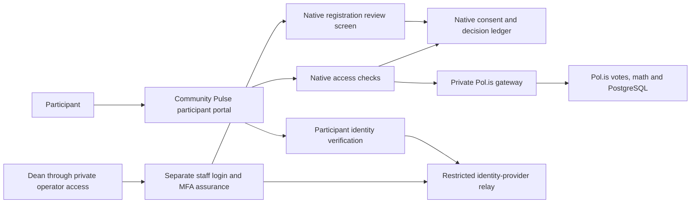

# WordPress-free Community Pulse — migration approval plan

**Plan ID:** `FNCP-NATIVE-MIGRATION-2026-10-07-v1`

**Owner:** Dean / Barayamal

**State:** architecture selected; migration execution pending exact approval

**Date:** 7 October 2026, Australia/Sydney

Dean selected “Remove WordPress.” The target is one Community Pulse application with its own registration, consent and staff approval, using self-hosted Pol.is for voting and analysis. This plan prepares that replacement for review. Migration execution has not been approved or implemented. The existing WordPress-dependent engineering candidate remains the baseline; this repository update changes documentation only.

Engineering belongs to [Barayamal/polis](https://github.com/Barayamal/polis). Module paths below refer to that engineering candidate, not the website code in this repository. The [current-state index](README.md) and [aggregate prior verification](PRIOR-SOURCE-VERIFICATION-2026-10-07.json) distinguish the selected target from historical source checks.

## Concrete target

Keep the current participant experience: sign in → declarations → registration → staff decision → private account-bound invitation → voting. Replace the WordPress registration/approval authority with a distinctly named native authority; provide a private native staff review screen. The chosen identity provider still handles account authentication. Removing WordPress does not turn sign-in or self-attestation into heritage verification.

Use new profiles rather than loosening the current WordPress contracts:

| Component | Proposed identity |
| --- | --- |
| Consent, registration and human decisions | `FNCP_NATIVE_APPROVAL_AUTHORITY_V1` |
| Participant/staff service composition | `FNCP_NATIVE_SERVICE_V1` |
| Access and invitation authority | `FNCP_NATIVE_ACCESS_V1` |
| Deployment and image-role contract | `FNCP_NATIVE_COMPOSE_V1` |
| Signed activation purpose | `FNCP_NATIVE_ACTIVATION_V1` |
| Joined backup/restore | `FNCP_NATIVE_JOINED_RECOVERY_V1` |
| Coordinated material renewal | `FNCP_NATIVE_JOINED_RENEWAL_V1` |

The native service must reject WordPress manifests, bridge instances, event routes, MAC domains, old activations and old backup bundles. **Do not create an object that passes `isProductionWordPressBridge`, imitates signed WordPress responses or returns manufactured WordPress approval status.** Shared low-level HTTPS/clock helpers may be reused after review; approval authority and its data contracts must remain explicitly native.

The [read-only staff-screen preview](NATIVE-STAFF-PREVIEW-2026-10-07.html) is prepared for review. It contains invented records, disabled actions and no script, login, network or database connection. It demonstrates the proposed interface, not staff authentication or a working approval system.

## Native registration and access contract

1. Use a fresh private native state namespace, a native-owned volume and `/var/lib/fncp-native/native.sqlite`, under the current single-writer ownership model. Native consent, registrations, decisions, access projection, provider jobs and invitation state share transaction authority. Do not attach or reinterpret `access.sqlite`, the legacy participant volumes, MariaDB or a WordPress option. Fresh installation also requires a fresh synthetic Pol.is conversation/provider namespace and rejects unexpected allowlist entries, participant records or response corpus; a fresh SQLite file alone is insufficient.
2. A verified current participant principal and three separately affirmative declarations create an immutable registration UUID, canonical consent receipt, notice version/digest and reserved lifetime slot in one transaction. The service derives the opaque account internally; callers cannot select it. Exact retries return the same reference; conflicting receipts fail.
3. Preserve the current 20-lifetime-registration and 15-fixed-statement pilot constraints initially. Pending, approved and revoked are the authority states; declining a pending registration uses terminal revocation. No revoked/declined slot is recycled. These are current pilot implementation constraints, not universal limits of Pol.is.
4. Record each human decision with immutable ID, version, timestamp, authenticated reviewer reference and audit digest. Preserve distinct `approve`, `decline` and `revoke` audit kinds even though decline/revoke share the terminal revoked state. Approval alone grants no voting access. Provider allowlist upsert and independent readback must succeed under the current decision, participant principal, activation and open round.
5. Revocation first commits its terminal tombstone, invalidates invitations/capabilities and persists a provider-removal job. Only then attempt removal. Outage or lost acknowledgement leaves durable pending removal and denial. An old approval, restart or restore cannot reopen the account.
6. Issue random, hashed-at-rest, single-use invitations through the registration reference. Bind them to the current account and decision; expiry is at most ten minutes and cannot outlive the identity session. Retain wrong-account, forwarding, expiry, replay, replacement and warm-session checks.
7. Every protected operation reads the current native authority before and after asynchronous provider work. Storage/configuration/clock faults or unexplained history close admission. A vote already transmitted may have an uncertain outcome; do not blindly replay it.
8. Persist the last-observed clock high-water and sticky clock/storage/history fault state in native metadata. Validate them on every reopen and preserve them through renewal and restore. A normal restart, a corrected clock or a new session cannot reset a fault or clear terminal denial.

## Recovery freshness and independent denial history

An internally consistent old backup can predate a later revocation. It cannot by itself prove current approval. Maintain a trusted decision/revocation checkpoint and complete decision history in independent custody outside the snapshot being restored, bound to the native deployment, epoch, monotonic sequence and ledger digest. Local tests use a separate synthetic custody namespace; no real off-host service is created by this plan.

All restored approvals remain quarantined until the restore proves the trusted current high-water and reconciles every later decision/tombstone/removal job. Missing, stale or uncertain independent history means remain closed. Do not use fresh staff approval, an old provider allowlist or an internally valid archive to override an unresolved or known terminal revocation. Approval effects require the native decision/checkpoint acknowledgment; revocation commits local denial first, and checkpoint uncertainty closes the generation without granting recovery authority. Define and test crash/ack ordering explicitly; make no cross-store atomicity claim.

## Explicit staff authentication and authorization

WordPress currently supplies staff session/capability/nonce controls. The replacement must supply real staff controls, not rely on a caller-supplied role or on possession of the existing UNIX socket alone.

- Build a separate staff authentication profile/client and in-process staff-principal type. Participant authentication can never confer staff authority.
- Authorize Dean through an immutable, configured issuer/subject allowlist and the explicit registration-reviewer permission. Do not use email text, email-domain matching, request fields or frontend state as the authorization source.
- Verify current sign-in and the selected provider's supported MFA assurance. Missing, stale or unsupported assurance denies a staff session; do not infer MFA from a successful login.
- Use secure staff cookies, bounded sessions, exact callback/Origin checks, CSRF protection and reauthentication for approve/revoke actions. Check staff authority at the mutation point and record the reviewer in the decision audit.
- Expose the native staff review screen only through the approved private operator route. Public participant ingress must reject staff routes. Review minimal registration references/declarations privately; never publish account mappings or participant records.
- The real provider, staff subject and assurance configuration will be verified during separately approved staging. Local development uses explicitly invented staff identities and HTTPS fixtures only.

## Proposed change set

| Area | Exact current dependency | Planned replacement |
| --- | --- | --- |
| Participant service | `production-service/service.mjs`, `access.mjs`, `browser.mjs`, `wordpress-bridge.mjs`, `event-receiver.mjs` | Add new native entrypoint/access/authority wiring; retain the old profile as historical. No WordPress-branded compatibility adapter. Keep the participant UI contracts where appropriate. |
| Consent and decisions | `production-wordpress/contract.php`, `store.php`, plugin review screen | New native schema/validator, canonical receipts, transactional decisions/removal jobs and private staff review screen. |
| Staff identity | Current WordPress login, capability and action nonce | Separate native staff identity/session/authorization profile, MFA assurance and action CSRF/reauthentication checks. |
| Private operator | `production-service/operator.mjs`, `operator-cli.mjs` | Version native commands and result schemas. Preserve activation, admission and invitation controls; socket ownership alone must not create a staff decision. |
| Deployment | `production-deployment/compose.mjs`, participant image recipe, WordPress/MariaDB recipes, `production-operator/gateway.mjs` | New native role/network descriptor and image inventory. Remove WordPress/MariaDB from this new profile only; retain private staff and participant ingress separation. Integrate restricted identity-provider egress without broad outbound fallback. |
| Fresh installation | `production-install/stage-material.mjs`, `install-closed.mjs`, `synthetic-input.mjs`, WordPress initialization phases | New native material/init/ownership validation; fresh native registry and staff configuration. Do not run a WordPress migration or adopt old stores. |
| Activation | `production-activation/protocol.mjs`, authority/signing helpers | New signing purpose and native schema/staff/authority/image bindings; old envelopes rejected. Offline signer remains outside runtime images. |
| Renewal/recovery | `production-service/recovery.mjs`, `renewal*.mjs`; `production-deployment/recovery*.mjs`, `joined-renewal.mjs` | Native inventories, framing and reconstruction. Preserve decision history, revocation tombstones, removal jobs, identity material and replay floors together. Restore closes access, clears sessions and consumes invitations. |
| Release/CI | `release-readiness/collect-candidate-release.mjs`, image/source inventories, `.github/workflows/fncp-option-c-ci.yml` | New native source/image checks, staff/authority tests, installed synthetic journey and new scan/recovery evidence. Previous V3 counts do not qualify the native candidate. |

Implementation should use separate native modules under `deploy/fncp/native-registration/`, `production-native-service/` and `native-deployment/`, extracting common code only with explicit profile checks and regression coverage. Keep current V1–V3 readers and stored evidence isolated.

The proposed core removes WordPress and MariaDB. Before egress integration, that leaves eight image roles, seven ordinary services and five durable volumes. The restricted relay and staff deployment must be included in the final native role lock; do not carry these provisional counts into a release claim.

## Execution sequence after approval

1. Create a dedicated local branch/checkout for this plan, preserving all current uncommitted work and a verified source rollback snapshot before any runtime-contract edits.
2. Implement the native authority/schema, receipt idempotency, consent/reference ownership, decision audit and synchronous terminal revocation.
3. Implement separate staff authentication/authorization and the private staff review screen with invented identities. Keep admission closed by default.
4. Wire the native participant/access/invitation path to direct validated ledger reads and current private Pol.is provider checks.
5. Add the native deployment, restricted egress, fresh installer/material custody, activation, renewal and joined recovery as one versioned contract. WordPress absence must be independently verified in its services, credentials, roles, mounts and archive inventories.
6. Run source and real local runtime verification, repair failures, then lock one candidate and rebuild/scan all native image roles. Record applicable finding decisions and portable digests.
7. Rehearse a full invented-person registration → named staff approval → invitation → native vote/math/export journey, negative cases, material renewal and an encrypted closed restore using the exact candidate.
8. Prepare the concrete costed closed-staging specification. Deployment, real-provider testing, publication, invitation sending, opening and any spending remain separate decisions.

## Required verification and acceptance

- Native constructors reject WordPress objects/configuration/events/backups and arbitrary injected approval providers.
- Twenty-slot capacity and exact consent/receipt retries hold under concurrency, restart and restore; revoked slots stay counted.
- Participant, wrong-staff, forged role, missing MFA, stale session, callback/CSRF and replay cases deny staff mutation. Valid named staff actions create the correct private audit.
- Approval has no effect until matching provider state is independently confirmed. Failures never upgrade an uncertain status into approval.
- Revocation during an awaited vote/upsert, provider outage, lost ACK and delayed approval leaves terminal denial and durable removal work. Warm sessions cannot continue.
- Wrong-account/forwarded/replayed/expired invitations and native direct-route bypasses fail; rightful single-use redemption works.
- Changed consent, staff policy, credentials, source/image lock or backward clock closes access and cannot be silently adopted.
- Native metadata clock high-water and sticky faults survive restart, renewal and restore. Fresh install refuses nonempty or mismatched provider namespaces.
- A pre-revocation backup cannot restore usable approval: independent high-water/history must reconcile later revocations. Missing checkpoint history quarantines approvals and keeps the recovered generation closed.
- Fresh native installation, renewal and joined encrypted restore preserve authority/access/provider state and start/end closed. Old WordPress material is rejected.
- Complete synthetic native voting/math/private export, source/image binding, dated scan review and portable-image checks pass on the new candidate. No participant content appears in technical evidence.

## Existing data and public-facing changes are separate

This local plan uses only fresh invented records. It authorizes no access to or import of retained registrations, consent, approvals, identifiers, allowlists, uploads or backups. It deletes nothing. Historical WordPress registration data retains its separate preservation-hold, current-count and fresh-confirmation process. This document contains no source identifiers or participant records.

Any real-data import would require a later exact source-filtered plan with authority, consent/binding mapping, reconciliation, verification and rollback. Any deletion would require its own applicable confirmation. Neither is necessary to build the fresh native pilot and neither is included here.

The community-wide purpose is confirmed. The first-pilot audience is still unanswered; keep geography-specific declarations configurable and synthetic while building. The old founder statements, round ID/window and derived deletion dates must not be applied to the broader round automatically. Public copy, valid dates/retention, participant invitations and publication are later reviewed changes.

## Preservation and rollback

The historical local engineering snapshot records base HEAD `9fccfec82797573dd5c873f1dee761378dff3706`, source fingerprint `4730e2988791cafdeab55003f3cc13e38a783a8bc1d09650cf1020af9e8023d3` and 1,995 source files. The fingerprint includes local uncommitted additions and must not be described as that base commit's tree digest. The [aggregate prior verification](PRIOR-SOURCE-VERIFICATION-2026-10-07.json) records 2,949 source tests and source-only WordPress/transport fixtures. Those checks were not rerun for this documentation update and do not qualify a native replacement, new images, hosted CI or a release.

Rollback means returning to the preserved source/profile in a closed, isolated synthetic deployment. It does not mean restoring native records into WordPress, reusing old activations, reopening access or deleting the new/old stores. If new tests fail, keep both profiles closed, preserve diagnostics and repair or stop the local candidate.

## Dean's execution choice

**Recommended — approve this bounded local migration.** Result: a separately versioned WordPress-free candidate is implemented and tested. Benefit: one application owns signup and approval without weakening the existing controls. Trade-off: staff authentication, image/material binding and recovery require substantial requalification. Next action: take the rollback snapshot and implement the sequence above.

Exact reply: **“Approve local native migration v1. Synthetic data only; no live changes, data imports/deletions, external sends, publication, deployment or spending.”**

**Alternative — approve the isolated native foundation first.** Result: native authority/schema and staff-authentication contracts are implemented and tested separately, with no current runtime wiring or deployment changes. Benefit: review the security core before integration. Trade-off: the full replacement needs a later integration approval. Next action: take the rollback snapshot and implement only sequence steps 2–3 as isolated modules, using the prepared preview for interface review.

Exact reply: **“Approve native foundation only. Synthetic data only; leave runtime integration and all live/data/external actions pending.”**

The architecture choice remains WordPress-free under either option. Current authority switching, schema/runtime edits and data operations are paused; inventory, contract/design refinement and synthetic interface drafting may continue.
